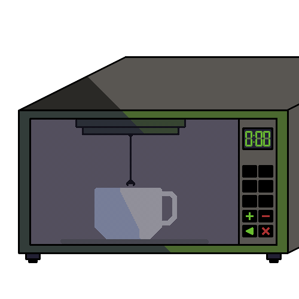

# Robot upgrade  

- Vlastnosti:  
    Můj robot by měl být vlastně advanced mikrovlnka.  
    Měl by mody na různé potraviny, hlavně pevné a kapalné.  
    Místo času by se nastavovala teplota na kterou má být jídlo připraveno.  
    To by bylo kontrolováno teploměrem.  
    Před měření kapalin (i polévek...), by robot jídlo zamíchal, aby nebyla tepla jen na vrchu.  
    Možná i další to jsem ještě nevymyslel.

- Konstrukce:  
    Na prozatimní funkce by robot vypadal jako normální mikrovlnná trouba.  
    Jen uvnitř budou jednoduchá ramena pro míchání a měření teploty.  
    Tím pádem možná trochu větší nebo robustnější než obvyklé mikrovlnky.

- Rozbor ceny:  
    Obvyklé normální mikrovlnky z kvalitních materiálů stojí něco kolem 3 tisíc Kč.  
    V tu chvíli co je vymyšlený software a výrobní linka, tak by náklady na výrobu neměly být o moc větší než na obvyklou mikrovlnku, odhadem 900 - 1000 Kč.  
    Spotřebitelská cena záleží na marketingu a daným maržím.

